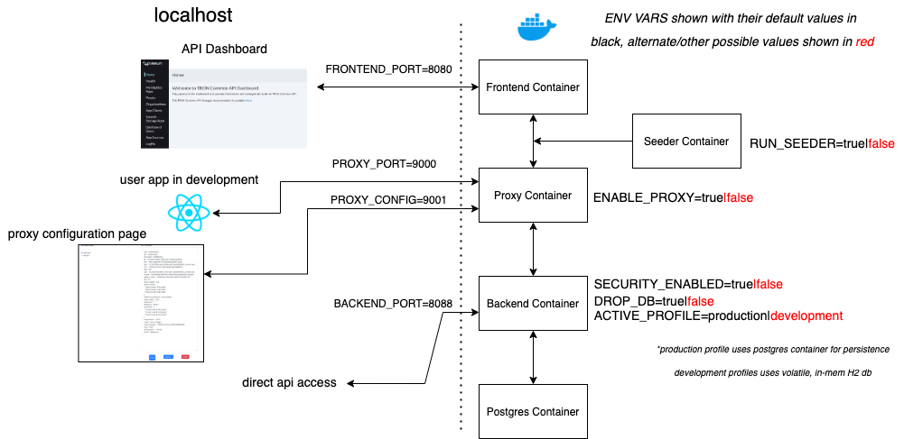
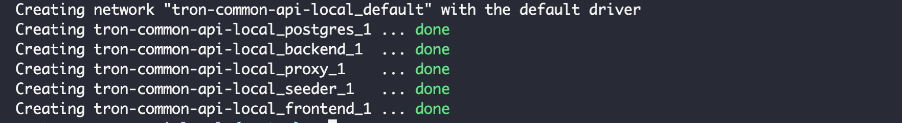
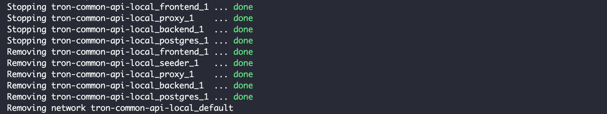

## Docker Compose for Tron Common API Local Testing

This repository hosts the docker compose file to get a full, local testing instance running
in your dev environment for integrating/testing with Common API.

_BEFORE_ cloning this repo, follow the steps below to get an environment setup.

1. Create or identify a local directory that will hold all of the Common API repositories (i.e. ~/tron-common)

2. `cd` into that directory and clone the following repositories:
    
    + tron-common-api-local (this repo)
    + tron-common-api
    + tron-common-api-dashboard
    + tron-common-api-proxy

3. Once the repos are cloned into your directory of choosing (the above repos must be at the same directory level as shown above), login into the code IL2 GitLab's container registry with the following command:

    `docker login registry.il2.dso.mil -u gitlab_ci_token -u <token>`

    where `<token>` is your GitLab token string (token must have registry access attributes chosen, if you're not sure, you can check in your GitLab account settings.  If it does not have these, simply create a new token that does)

4. Once you get a successful login into the container registry, issue the following command:

    `docker-compose up -d`

    This will start all the needed containers (after pulling the images it needs from both Docker Hub and the code IL2 registory).  Note for the first start-up, this could take **several** minutes. Subsequent starts should take considerably less time.  Should see something like this:

    

5.  Once the bootup completes, navigate to http://localhost:8080 to access the Tron Common API Dashboard as the default admin user (John Tester - jt@test.mil).  

6.  Configurable options lie with the environment variables.  The overall diagram of the compose setup above shows the ENV VARS that are intended to be configured.  The default values are show in black and the other/alternate values are shown in red.

    *RUN_SEEDER* - runs the seeder script on startup.  The seed data is an entire Wing with its subordinate groups, squadrons and flights + members.

    *ENABLE_PROXY* - enables the proxy (if disabled traffic still flows through this but no headers are injected).  The proxy injects the currently selected JWT (defaults to admin.jwt in the Proxy container which has the email address of the default admin - jt@test.mil).  Proxy can be configured over its web interface on the localhost's 9001 port.

    *SECURITY_ENABLED* - enables Spring security (default to ON) where the backend applies roles and privileges based on JWT and/or the Istio X-forwarded-client-cert header (for app to app communication).  
    
    + Note that if security is enabled and settings are set to use the H2 db (see below), the H2 console still cannot be accessed from the web console - this is due to the H2 setting to refuse remote connections.
    + Also note that with security disabled, the dashboard will not work correctly either since the client app looks for a role back from the db - which it will not receive since it pays no attention to JWTs in this mode.

    *DROP_DB* - if enabled, the Postgres DB is first dropped before any migrations

    *ACTIVE_PROFILE* - defaults to `production` which looks to use the postgres db to persist data across sessions.  If set to `development` the backend will use a Java-H2 in-mem database.

7. To stop the stack, issue command:

    `docker-compose down`

    This will result in something like this:

    